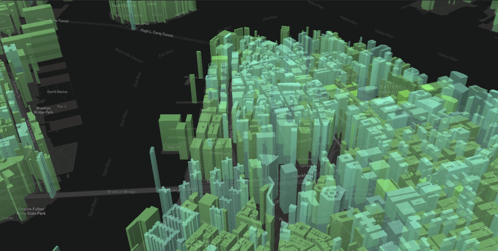

# OpenCityDancer

OpenCityDancer is a fun "what if" you made open city data a music equalizer. After a quick google I saw MapBox had done something similar with [ambient noise](https://docs.mapbox.com/mapbox-gl-js/example/dancing-buildings/), which I ended up using as a starting point.

View Live: https://cwhite911.github.io/OpenCityDancer/

